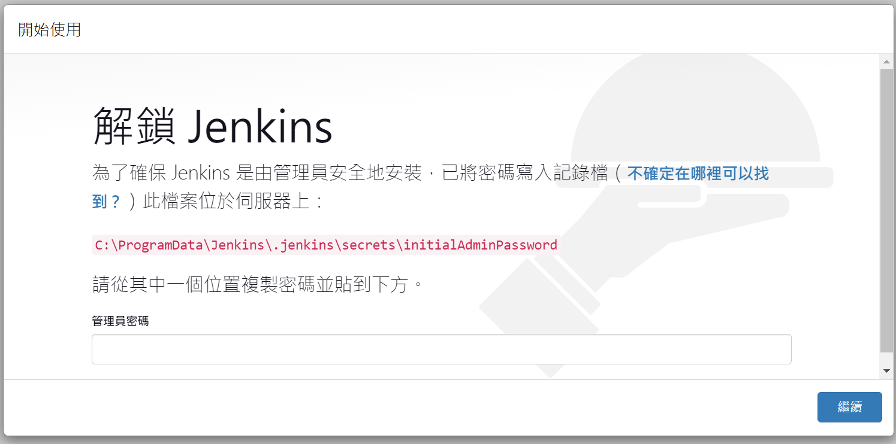
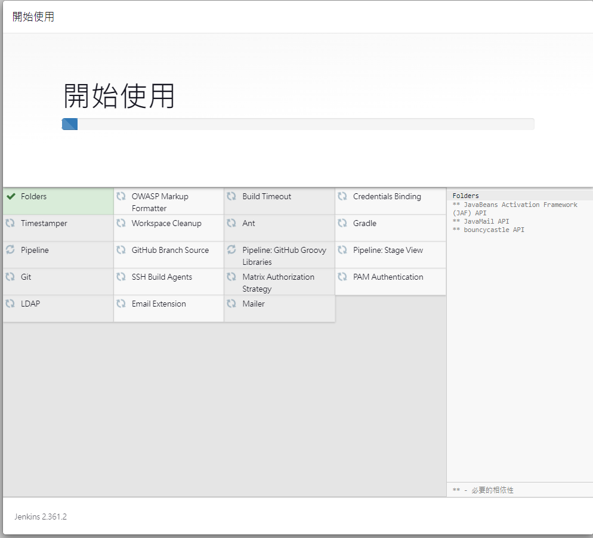
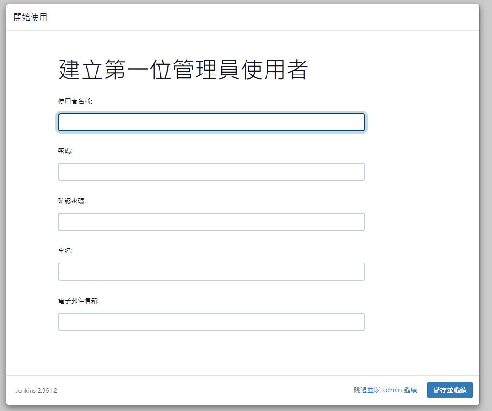
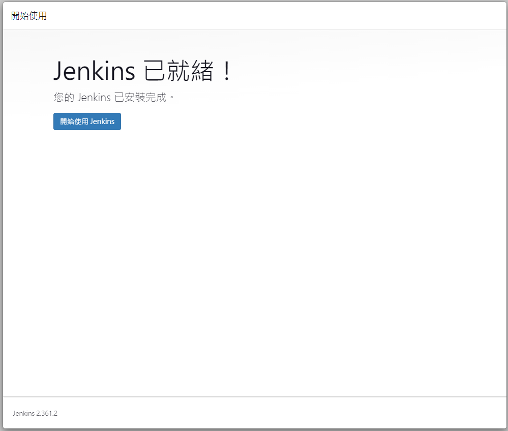

# PythonJenkins

Windows:

安裝 Jenkins:
https://www.jenkins.io/download/

安裝 Java 17:
https://www.oracle.com/java/technologies/javase/jdk17-archive-downloads.html

---
Jenkins server: http://127.0.0.1:8080
首次開啟

選擇安裝推薦外掛

安裝完成後設定 Admin 資訊

設定 URL

接著就可以使用 Jenkins

---

### Ref
https://pypi.org/project/jenkinsapi/
http://127.0.0.1:8080/
https://www.cnblogs.com/hujinzhong/p/14593293.html
